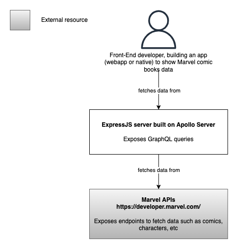

# Table of Contents
- [Table of Contents](#table-of-contents)
  - [How to install](#how-to-install)
  - [How to run in local environment](#how-to-run-in-local-environment)
  - [Apollo Studio](#apollo-studio)
  - [Architecture](#architecture)
    - [C1 Context](#c1-context)
  - [Queries](#queries)
    - [Response](#response)

**Cerebro** is an ExpressJS server, running on Apollo Server, that provides access to information about Marvel comics, characters and more.

## How to install

To install required dependencies, run

```
npm install
```

> Developed with Node v14.15.4

## How to run in local environment

First, create a `.env` file (see `.env.example`) and paste your public and private key to access Marvel Developer APIs.
Then, in the root folder, run

```
npm run dev
```

You will see something like this in the terminal

```
🚀 Server is ready at http://localhost:4001/graphql
```

Open a web browser and visit http://localhost:4001/graphql.

## Apollo Studio

Every time I start the server, the schema is automatically registered on [Apollo Studio](https://studio.apollographql.com/graph/cerebro). Publishing the schema unlocks useful festures such as **usage statistics** and the **schema changelog**.

## Architecture

### C1 Context



## Queries

| Query       | Description | Params |
| ----------- | ----------- | ------ |
| `getCharacters` | Returns an array of characters | limit: number (default 20) |
| `getCharacterById` | Returns an array with one character or an empty array if no character is found | `*` id: number |
| `getCharacterById` | Returns an array with one character or an empty array if no character is found | `*` id: number |
| `getComics` | Returns an array of comics | limit: number (default 20) |
| `getCreators` | Returns an array of creators | firstName: string, lastName: string |

`*` mandatory param

### Response

The `Response` type is a *union type*:

```
union Result = Character | Comic | ...

type Response {
  offset: Int!
  limit: Int!
  total: Int!
  count: Int!
  results: [Result]!
}
```